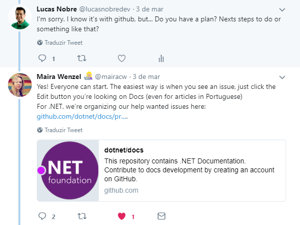
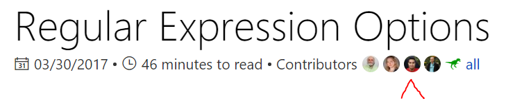
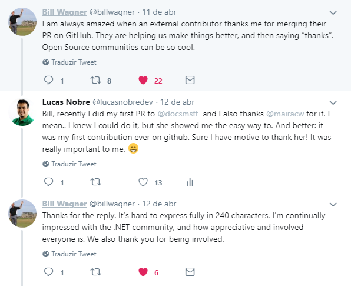
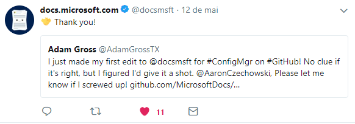

## Notas do autor ##
> _Além de contar sobre a minha experiência, gostaria que este artigo fosse também sobre você, que nunca contribuiu antes, comece a fazê-lo! Eu estou tendo uma experiência muito bacana com a Microsoft e espero ser uma porta de entrada para mais contribuidores. 
PS: o artigo exige um conhecimento mínimo de Git._

---

Pra quem não sabe, a **[Microsoft é uma das principais contribuidoras](https://www.infoworld.com/article/3253948/open-source-tools/who-really-contributes-to-open-source.html)** do Open Source. Desde a chegada do Satya Nadella como CEO, ela tem tomado várias decisões ao longo dos anos que pra muitos parecia improvável, [como se tornar um membro da Linux Foundation](https://open.microsoft.com/2016/11/17/microsoft-joins-linux-foundation/), [o encerramento do CodePlex](https://blogs.msdn.microsoft.com/bharry/2017/03/31/shutting-down-codeplex/), [a migração de todo o código fonte do Windows para o GitHub](https://www.codigofonte.com.br/noticias/microsoft-move-todo-o-codigo-do-windows-para-o-git), [o .NET Core](https://blogs.msdn.microsoft.com/dotnet/2014/11/12/net-core-is-open-source/) e por último: [a aquisição do GitHub](https://www.zdnet.com/article/linux-foundation-microsofts-github-buy-is-a-win-for-open-source/).

Eu ouvi falar sobre a Microsoft e o Open Source há algum tempo, mas apenas recentemente tive a chance de contribuir e obter minha primeira experiência. Assim, pude tirar minhas próprias conclusões e aqui vou comentar como foi esse processo através de algumas etapas chaves:

- Guia de contribuição
- Issues
- Pull Request

Tudo começou quando eu estava olhando minha timeline no Twitter [e a Maira Wenzel tweetou](https://twitter.com/mairacw/status/969636807292813313) agradecendo a comunidade sobre todo o trabalho feito na [documentação do .NET](https://docs.microsoft.com/en-us/dotnet/) naquele mês. Eu, que já havia tomado um puxão de orelha de amigos por não ter começado a contribuir no GitHub, vi que era a oportunidade perfeita!

# Guia de contribuição #
Antes das issues, ela me recomendou ler [o guia de contribuição](https://github.com/dotnet/docs/blob/master/CONTRIBUTING.md) do repositório. Se você possui o domínio do inglês para leitura + domínio do básico do Git, acredito que seja muito simples entender as regras para contribuir.

É muito importante que você leia o guia de contribuição de qualquer repositório antes de mais nada. Vai evitar dúvidas bobas e você entenderá rapidamente como o time trabalha.

A primeira etapa do guia mostra o passo a passo para você começar. Existem três formas:

- Escrever um novo conteúdo ou revisar algum existente. A partir disso você deve criar uma issue explicando sua sugestão.
- Ver os [projetos](https://github.com/dotnet/docs/projects/35) já discutidos e em desenvolvimento pela comunidade.
- **[ESCOLHIDA]** Ver as issues em discussão e se voluntariar para a tarefa.

Após a tarefa ter sido direcionada a você, dê um **[Fork](https://help.github.com/articles/fork-a-repo/)** no projeto e crie sua branch para fazer as alterações necessárias.

Caso você decida revisar algum conteúdo existente e haja pequenos erros, como por exemplo erros gramaticais ou traduções incorretas, a sua contribuição pode ser feita de forma muito mais simples. Todo artigo possui um botão de edição. Ao clicá-lo, você será redirecionado e poderá fazer sua sugestão de melhoria pela própria interface do GitHub! A Microsoft possui um passo-a-passo específico para essas melhorias mais simples. Você pode dar uma olhada neste [link](https://docs.microsoft.com/en-us/contribute/#quick-edits-to-existing-documents).

O guia também explica a estrutura do projeto e esclarece que os artigos são arquivos Markdown. Para mais informações sobre o Markdown, veja este guia. Existem mais passos, mas prefiro não dar mais spoilers. [Leia o guia de contribuição](https://github.com/dotnet/docs/blob/master/CONTRIBUTING.md)!

# Issues #

Ao olhar as issues, procurei a mais simples para ajudar, já que era a minha primeira vez. Por fim, caí [nesta discussão](https://github.com/dotnet/docs/issues/4439) sobre "inconsistência das palavras white-space/white space" e logo me voluntariei pra fazer as correções. Fui orientado pelo Ron Petrusha, onde ele me ajudou a entender exatamente o problema, as formas que eu poderia solucioná-lo, abertura de pull requests, política de branches, enfim, muitas coisas já citadas no guia de contribuição. No final, Ron me pediu para avisá-lo caso iniciasse a tarefa, para que ele a adicionasse nos Projetos do repositório.

Como vocês podem ver, a issue ainda não foi concluída. Estou no meio do caminho. Até a data deste artigo já havia revisado o docs/csharp, docs/standard e o docs/core. Caso alguém queira me ajudar a concluí-la, comente na issue e vamos dividir a tarefa!

## Dica #1! ##
Enquanto você está desenvolvendo sua tarefa, é provável que a documentação receba atualizações de outros contribuidores, portanto, mantenha seu fork sempre atualizado. Segue alguns comandos do git que podem te ajudar:


# Fetch from upstream remote
git fetch upstream
# Checkout your master branch and merge upstream
git checkout master
git merge upstream/master
# Checkout your branch and merge master
git checkout your-branch
git merge master


Caso haja conflitos que te impossibilite de fazer o merge, use uma ferramenta como o VS Code para solucioná-los. Não vou me aprofundar, mas existe uma doc muito bacana sobre versionamento com ele. [Acessem lá](https://code.visualstudio.com/docs/editor/versioncontrol#_merge-conflicts)!

Para fazer download do VS Code, [clique aqui](https://code.visualstudio.com/download).

## Dica #2! ##
Um grande incentivo para você usar o VS Code quando estiver contribuindo para a documentação da Microsoft é o [Docs Authoring Pack](https://github.com/Microsoft/vscode-docs-authoring). Ele atribui várias funcionalidades como um assistente para a criação de Markdown e visualização do arquivo como um artigo. Você pode ler um pouco mais sobre ele [aqui](https://docs.microsoft.com/pt-br/teamblog/docs-extension). E adivinha? Também é open source!

# Pull Request #

Duas coisas bem legais que devem ser citadas ao abrir seu primeiro pull request. Primeiro: o time adiciona uma label de "1ª contribuição no docs", então eles possuem todo um cuidado com você pra ter a melhor experiência possível, afinal, a ideia é que você continue sendo um contribuidor!

Segundo: você precisa "aceitar e assinar" o contrato de licença de contribuidor da .NET Foundation! Não sei para os outros contribuintes, mas ao ser redirecionado para Microsoft e se vincular através da licença, me senti realmente fazendo parte daquela obra. A sensação é maravilhosa.

O time irá revisar o seu pull request, não só o que você alterou, mas também tudo o que está envolvido àqueles artigos. Por exemplo, em algum dos PRs que eu abri, Ron me pediu uma alteração no exemplo de código que estava sendo chamado naquele tal artigo. Então acredito que cada PR é uma oportunidade do time revisar a documentação a todo momento e encontrar falhas que não haviam sido notadas antes.

Após a revisão do time, voilà! O seu pull request será  m̶e̶r̶g̶e̶a̶d̶o mesclado a versão oficial da documentação.

## Dica #3! ##
Assim como citado no guia de contribuição, coloque na descrição do seu PR o  seguinte trecho:


Fixes #Issue_Number


Ele faz referência a issue em que você está trabalhando. Além disso, assim que haver o merge entre sua branch e master, a issue será fechada. Você pode usar outras palavras além do fixes para o mesmo propósito como close, resolve, entre outros. Para saber mais, consulte este artigo.

Caso seu pull request não esteja solucionando toda a issue, apenas cite o seu número. O importante é manter o vínculo entre a issue e o pull request.

O que me leva a quarta dica:

## Dica #4! ##
Se você estiver fazendo muitas alterações e em muitos arquivos numa única branch…

Não abra grandes PRs!!! 
Isso não é só na documentação da Microsoft ou nos projetos open source. Em qualquer projeto que você estiver, não abra um PR gigantesco. Se notar que as alterações estão crescendo, crie uma outra branch para seguir e abra um PR pequeno. Facilite a revisão.

# Venha fazer parte! #
Como eu disse durante o texto, se você notar o diálogo do time com os contribuidores nas issues e nos pull requests, eles são super atenciosos e estão ali prontos para te ajudar a ter a melhor experiência possível de contribuição. 

Mas de toda a experiência como um todo, o que eu mais gostei foi a forma como todos me fizeram sentir sobre a minha contribuição. Desde o primeiro momento fizeram com que eu me sentisse parte da obra, da comunidade, do time. Sem exageros, eu me sinto de fato um membro externo da Microsoft, onde ela e a comunidade podem contar comigo para uma documentação de qualidade.

No Twitter eu postei um agradecimento a Maira pelo meu primeiro pull request aprovado e me agradeceram também pelo trabalho. Bill Wagner citou o quão impressionado ele é com a comunidade .NET e como somos tão envolvidos na causa.

E acredito que não seja só eu que me sinta assim. O twitter oficial da própria documentação, o [@docsmsft](http://twitter.com/docsmsft), interage bastante com todos nós e costuma retweetar muitos agradecimentos de novos contribuidores.

E você, está esperando o que pra começar?